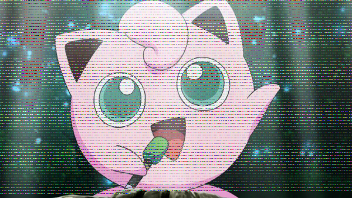
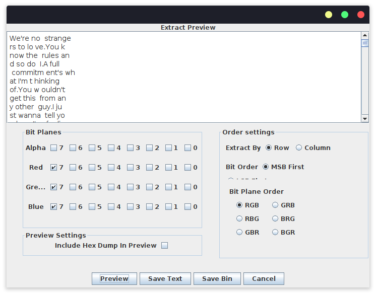
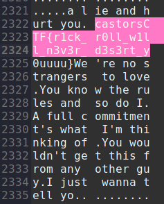

# Jigglypuffs Song Challenge Write-Up

#### Upon Introduction

Starting this challenge, we were greeted with the message "Can you hear Jigglypuff's song?" and an attached PNG: "chal.png". 

Upon opening the image, it's immediately obvious this is no ordinary image of Jigglypuff, this image has definitely been manipulated in some way and it's pretty obvious something is being hidden here.

#### The process

First, I decided to open this image in a hex editor; in this case I used [GHex](https://wiki.gnome.org/Apps/Ghex). I scrolled through the outputted data and found, right at the bottom of the file, a collection of binary bytes:

`01101000 01110100 01110100 01110000 01110011 00111010 00101111 00101111 01100010 01101001 01110100 00101110 01101100 01111001 00101111 00110011 01100100 00110111 01000110 01110010 01110110 01010111`

I immediately decided to run this through a binary to text tool, to see if there was some message being hidden here. As it turns out, there was in fact quite the message being hidden here: https://bit.ly/3d7FrvW

A link! Finally, a decent step forward into solving this challenge! Let's see where this link leads...

https://www.youtube.com/watch?v=dQw4w9WgXcQ

._.

*sigh*

*Well at least we now know Jigglypuff's song I guess...*

After a long 3 minutes and 32 seconds of accepting my rickroll, I hopped back into solving this challenge.

#### Most Significant Bits

So the first attempt was evidently too obvious- the challenge wants me to look harder. Then, it hit me: Most Significant Bits.
I immediately hopped into my program of choice, stegsolver, to extract the most significant bytes. After selecting the Red Green and Blue, Most Significant Bit, bit planes, I conveniently found the lyrics to Never Gonna Give You Up, all throughout the extracted data. *I can definitely hear Jigglypuff's song at this point.*

As these lyrics were all throughout the extracted data, I wondered if there was more than just a rickroll in there. I then saved the dump and searched, in Gedit, for the format of this CTF's flags "castorsCTF{" to see if the flag was hidden somewhere in here.

`castorsCTF{r1ck_r1ll_w1ll_n3v3r_d3s3rt_y0uuuu}`

#### Submission

At last! Now with the flag in my hands, completion in sight and eagerness to validate if this is yet another rickroll, I submitted the flag.

**__Success! The flag was correct!__**

