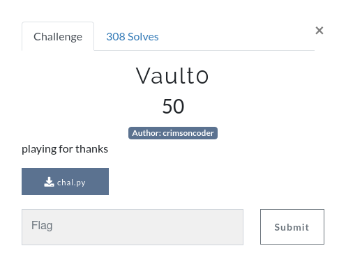

# Vault 0



#### Upon introduction
Starting this challenge we were greeted with the message "playing for thanks" and an attached python script: "[chal.py](https://github.com/Hirora/Castors-CTF-Writeups/blob/master/Vault0-Challenge/chal.py)".

#### The process
When you open the script, you are met with, overall, a fairly simple program; a function called "checkpass" which requests for the password and encodes it multiple times to verify that it matches the encoding of the correct password, along with a fairly simple main function which outputs whether the password is correct or not.

As soon as I saw this algorithm, it was fairly obvious what the vulnerability was here: hardcoding the password into the script and checking that the inputted one matches this. Now, all we have to do is reverse this to get the password.

Reading through, it's fairly obvious that, to get to the correct password and check the inputted vs original password, the program just checks to see that the each part of the password matches up to the hex of the that part of the actual password. Now while we can just run each of these encoded hex strings through a hex to text tool online (e.g `63617374` in hex is `cast`), that's not fun by any means, so I wrote a short python script to do it for me.

#### The script
Starting off, I initialize each string of hex encoded characters, from the start of the encoding algorithm to the end, into an array:

```
encoded = ["63617374","6f72734354","467b723178","54795f","6d316e","757433735f6774","5f73317874795f6d","316e757433","737d"]
```

Next, I establish the variable `string = ""` and then loop through the array, decoding the hex into UTF-8 format and then appending this to the string variable:

```
for i in encoded:
    string = string + codecs.decode(codecs.decode(i,"hex"),"utf-8")
```

#### Submission
Now all we need to do is `print(string)` to get our result: `castorsCTF{r1xTy_m1nut3s_gt_s1xty_m1nut3s}`
With this, we submit...

**__Success! The flag was correct!__**

*The original script can be found [here](https://github.com/Hirora/Castors-CTF-Writeups/blob/master/Vault0-Challenge/script.py) in this repo*
